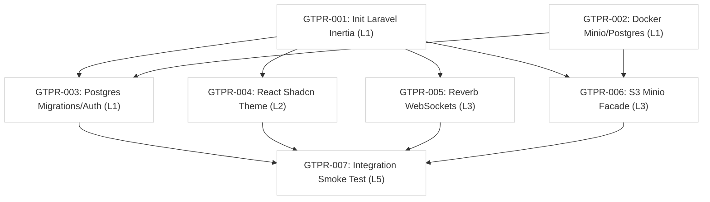

# Global Dependency Graph

This document tracks the execution order of all features across the GitarPro project.

## Current Build Order

## Ready to Start
The following stories have no pending dependencies and block downstream work. They should be picked up immediately:
*   [ ] **GTPR-001**: Init Laravel Inertia
*   [ ] **GTPR-002**: Docker Minio/Postgres
