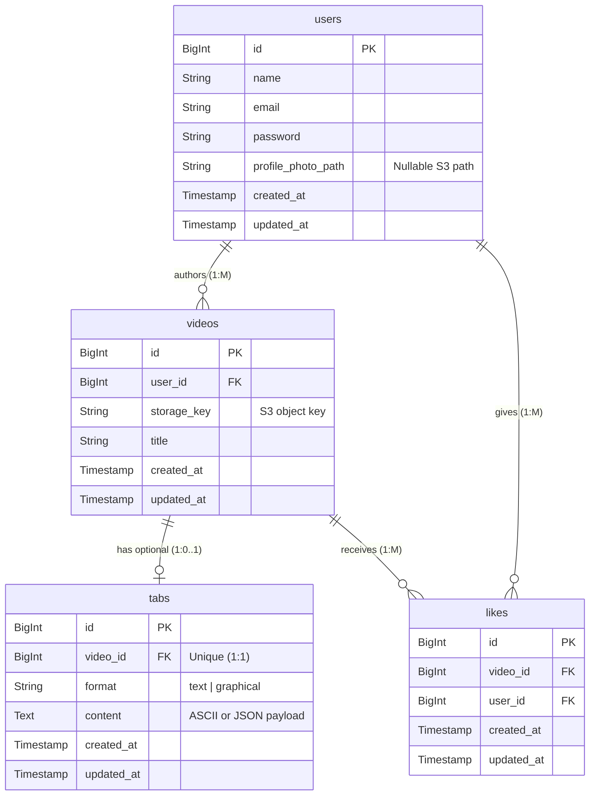

# Core Entity Relationship Diagram (PostgreSQL Schema Blueprint)

This document defines the core data model for the GitarPro application, specifically tailored for a standard SQL relational database structure, optimized for Laravel's Eloquent ORM.

## 1. PostgreSQL Core ERD

---

## 2. Entity Descriptions and Constraints

### `users`
*   **Description**: Registered application users.
*   **Source**: Created via Laravel Breeze authentication scaffold.
*   **Constraints**: `email` must be strictly `UNIQUE`.

### `videos`
*   **Description**: Represents a guitar cover performance.
*   **Foreign Keys**: `user_id` maps to `users.id` with `ON DELETE CASCADE`.
*   **Notes**: The `storage_key` holds the MinIO object name. Laravel generates temporary presigned URLs to stream the content to the frontend via this key. 

### `tabs`
*   **Description**: Musical notation attached to a performance.
*   **Foreign Keys**: `video_id` maps to `videos.id` with `ON DELETE CASCADE`.
*   **Relationship Rule**: 1:1 Optional. We enforce the 1:1 strictly by making `video_id` a `UNIQUE` foreign key column on the `tabs` table to prevent multiple tabs per video.

### `likes`
*   **Description**: Tracks user engagement (who liked what video).
*   **Foreign Keys**: `video_id` maps to `videos.id` (CASCADE), `user_id` maps to `users.id` (CASCADE).
*   **Performance Note**: Fetching the `count()` of related likes is natively optimized via Laravel's `$video->withCount('likes')` which prevents massive N+1 queries during the feed render.

---

## 3. Recommended PostgreSQL Indexes (Migrations)
During migration creation in Laravel, ensure these indexes are added:
1.  **Feed Sort**: `INDEX on videos(created_at DESC)` for the main feed.
2.  **User Profile Videos**: `FOREIGN KEY` index automatically generated by Laravel on `videos.user_id`.
3.  **Unique Like Constraint**: A `UNIQUE` compound index on `likes(user_id, video_id)` to prevent a single user from liking the same video twice at the database level.
