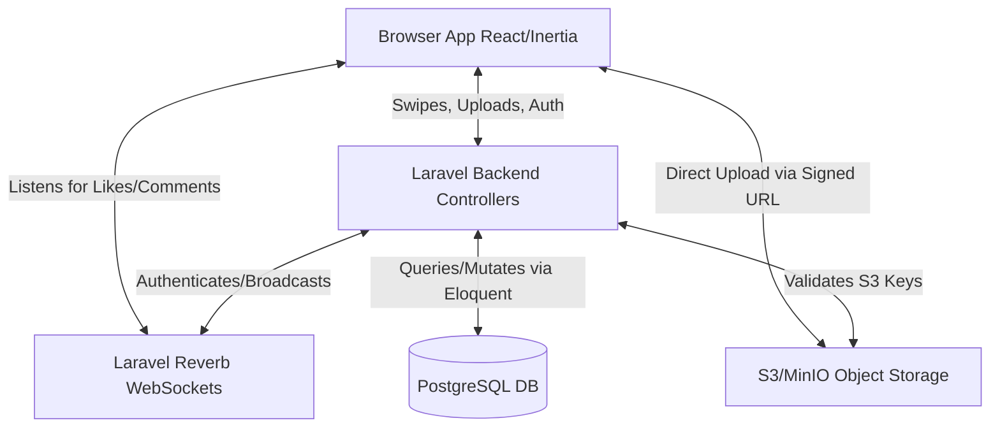

# Tech Stack & Architecture Decision

## 1. Overview
- **Project Name**: GitarPro
- **Type**: Web Application (Mobile-First UI)
- **Primary Constraints**: 
    - 1-Week MVP Launch Window.
    - Strong requirement to self-host all infrastructure to control costs and retain data ownership.
    - TikTok-inspired vertical scrolling feed requires high performance and potentially real-time data sync for likes/comments.

---

## 2. Architecture Style
- **Pattern**: Modular Monolith via Server-Driven Client Routing.
- **Justification**: The speed required for a 1-week launch demands a robust, "batteries-included" monolith that eliminates API serialization boilerplate. Laravel (via Inertia.js) routes directly to React components as views, retaining the modern SPAs (Single Page Application) feel and React UI ecosystem (Tailwind + shadcn/ui) without the cognitive load of a separated backend.

---

## 3. Technology Decisions

| Layer | Choice | Alternatives Considered | Why This Choice |
| :--- | :--- | :--- | :--- |
| **Frontend Framework** | **React (via Inertia.js)** | Next.js, Vue | Keeps the modern React ecosystem (shadcn/ui, framer-motion) but eliminates the need for manual API endpoints. Laravel acts as the routing controller, passing data securely and cleanly to React components on the fly. |
| **UI Styling** | **Tailwind CSS + shadcn/ui** | Styled Components, Chakra UI | Fastest path to a polished, modern cinematic UI tailored for mobile-first TikTok-like scrolling interfaces. |
| **Backend Framework** | **Laravel (PHP)** | Node.js (Next API), Go | Laravel includes robust database auth (Breeze), queue workers, rate limiters, storage abstractions (MinIO), and WebSockets natively, drastically accelerating the MVP. |
| **Database** | **PostgreSQL** | Convex, MySQL | A robust, standard relational database. Handled cleanly via Laravel's Eloquent ORM. |
| **Authentication** | **Laravel Breeze** | NextAuth, Clerk | Built-in Laravel starter kit providing immediate, secure registration, login, and session-based auth out-of-the-box perfectly synchronized with React/Inertia. |
| **Object Storage** | **S3-Compatible (MinIO)** | Local Disk, AWS S3 | Video files are large. MinIO provides an S3-compatible API that can be self-hosted securely and linked natively via Laravel's `Storage` facade. |
| **Realtime** | **Laravel Reverb** | Pusher, Socket.io | Built-in, high-performance WebSocket server to instantly broadcast feed events, video uploads, or "Likes" without paying a third party. |

---

## 4. Architecture Diagram



---

## 5. Key Architecture Decisions (ADRs)

### ADR 1: Monolithic Routing via Inertia.js
- **Decision:** Use Inertia.js to glue React to Laravel rather than making Laravel a headless JSON API and Next.js a standalone client.
- **Context:** Decoupled systems (Next + API layer) are fantastic at scale but drastically slow down single-developer MVPs by forcing 2x the routing and data-mapping overhead.
- **Consequences:** We write components in React exactly as if it were Next.js, but our "page controllers" live in PHP, providing an incredibly fast, type-controlled pipeline from Postgres directly to UI props.

### ADR 2: Direct-to-Storage Video Uploads
- **Decision:** Clients will request a pre-signed URL (or equivalent mechanism) from the server and upload video files directly to the S3-compatible storage, rather than proxying huge video files through the Next.js API.
- **Context:** Proxying video uploads through a Node.js server consumes high memory and bandwidth, causing bottlenecks on a single self-hosted node.
- **Consequences:** Better server performance. Requires implementing secure pre-signed URL generation and tracking upload status via webhooks or client-side confirmation.

---

## 6. Development Environment

### Local Setup Requirements
- **Node.js**: v18 or later.
- **Docker**: Required for running Convex local backend and MinIO storage locally.
- **Git**: For version control.

### Required Environment Variables Outline
```env
# NextAuth
NEXTAUTH_SECRET="..."
NEXTAUTH_URL="http://localhost:3000"

# Convex
CONVEX_DEPLOYMENT="..." # For cloud, but we will configure for local/self-host
NEXT_PUBLIC_CONVEX_URL="..."

# S3 Compatible Storage (MinIO)
S3_ENDPOINT="..."
S3_ACCESS_KEY="..."
S3_SECRET_KEY="..."
S3_BUCKET_NAME="..."
```
